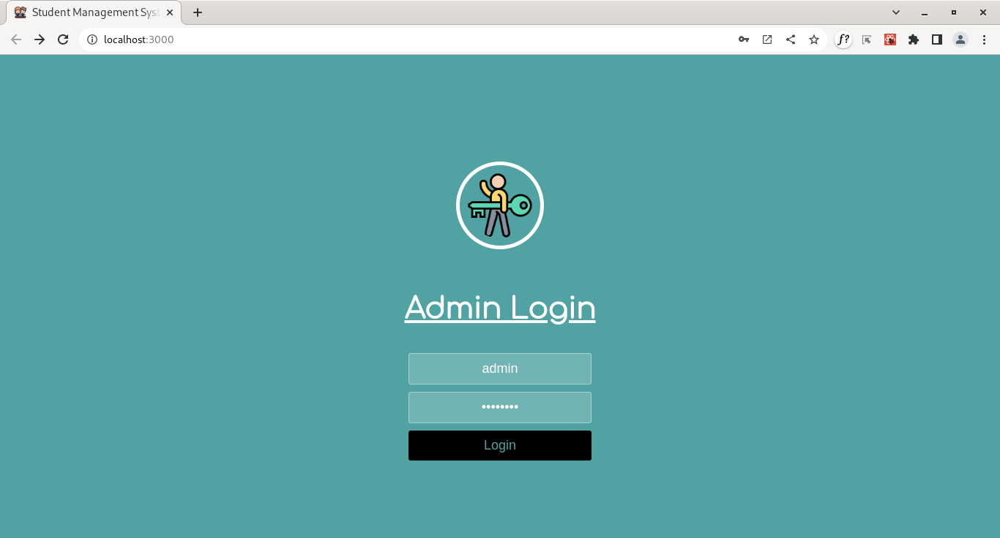
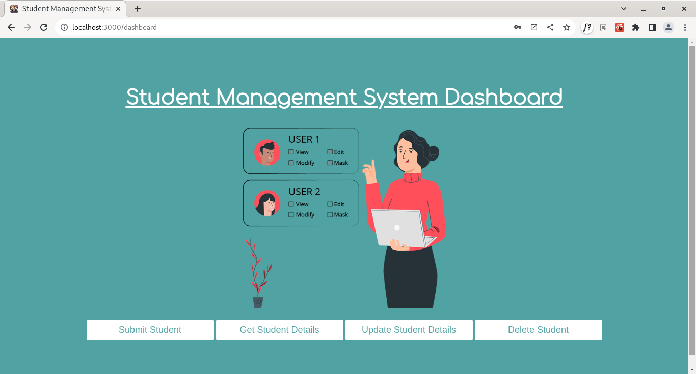
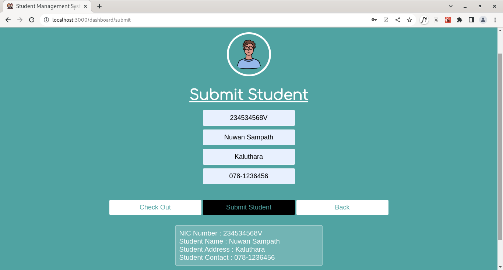
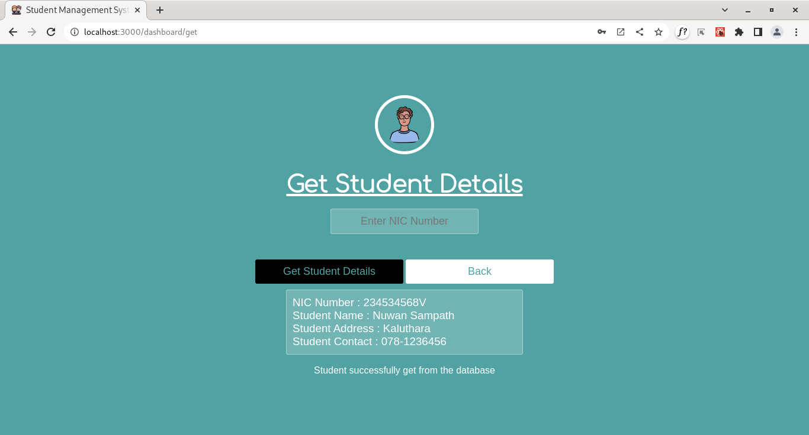
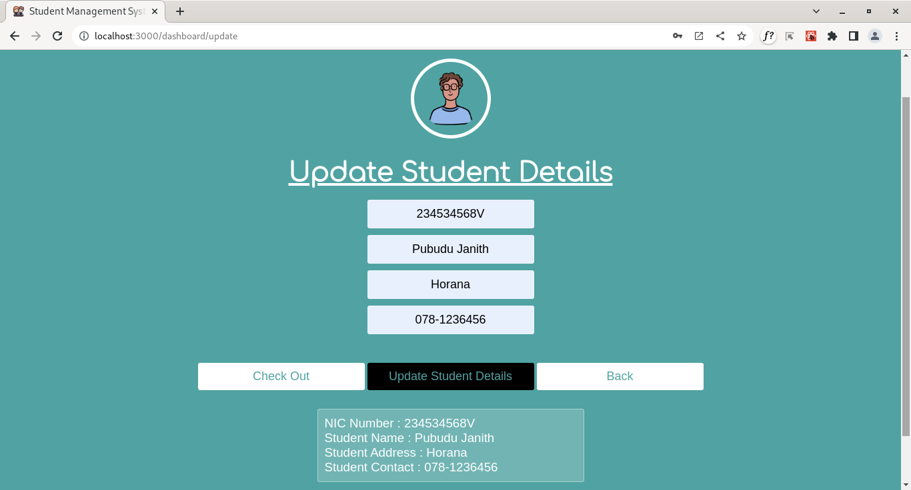
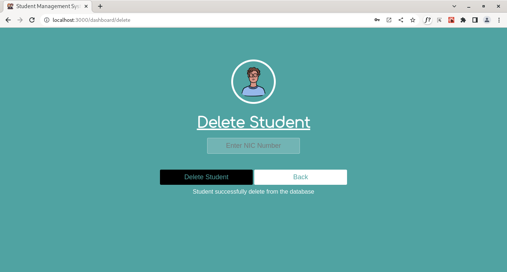

# Student Management System - Front End 

This project was bootstrapped with [Create React App](https://github.com/facebook/create-react-app).

This project was created with the **React JS library** in order to better understand and utilize the React JS library.
This project includes the basic CRUD activities of a student management system.

See the back end of the project from [here.](https://github.com/PubuduJ/student-management-system-back-end) 
See the **React with TypeScript** front end of the project from [here.](https://github.com/PubuduJ/student-management-system-front-end-ts)

#### Highlighted features of the application,
- Students are registered to the system by their NIC number.
- A system administrator can enter, amend, remove, and retrieve student information.

#### Images of the user interfaces

1. Admin Login Page 
   

2. System Dashboard 
   

3. Submit Student Page 
   

4. Get Student Details Page 
   

5. Update Student Details Page 
   

6. Delete Student Page 
   

## Used Technologies

- React JS
- React Router 6
- Axios
- CSS3

#### Used Integrated Development Environment
- IntelliJ IDEA

## How to use ?
- This project can be used by cloning the
project to your local computer.
- Clone the project using `https://github.com/PubuduJ/student-management-system-front-end.git` terminal command.

## Available Scripts

In the project directory, you can run:

### `npm start`

Runs the app in the development mode.\
Open [http://localhost:3000](http://localhost:3000) to view it in your browser.

The page will reload when you make changes.\
You may also see any lint errors in the console.

### `npm test`

Launches the test runner in the interactive watch mode.\
See the section about [running tests](https://facebook.github.io/create-react-app/docs/running-tests) for more information.

### `npm run build`

Builds the app for production to the `build` folder.\
It correctly bundles React in production mode and optimizes the build for the best performance.

The build is minified and the filenames include the hashes.\
Your app is ready to be deployed!

See the section about [deployment](https://facebook.github.io/create-react-app/docs/deployment) for more information.

### `npm run eject`

**Note: this is a one-way operation. Once you `eject`, you can't go back!**

If you aren't satisfied with the build tool and configuration choices, you can `eject` at any time. This command will remove the single build dependency from your project.

Instead, it will copy all the configuration files and the transitive dependencies (webpack, Babel, ESLint, etc) right into your project so you have full control over them. All of the commands except `eject` will still work, but they will point to the copied scripts so you can tweak them. At this point you're on your own.

You don't have to ever use `eject`. The curated feature set is suitable for small and middle deployments, and you shouldn't feel obligated to use this feature. However we understand that this tool wouldn't be useful if you couldn't customize it when you are ready for it.

## Credits
This project was carried out under the guidance of the [IJSE](https://www.ijse.lk/) Direct Entry Program 9.

## Version
v1.0.0

## License
Copyright &copy; 2023 [Pubudu Janith](https://www.linkedin.com/in/pubudujanith94/). All Rights Reserved. 
This project is licensed under the [MIT license](LICENSE.txt).